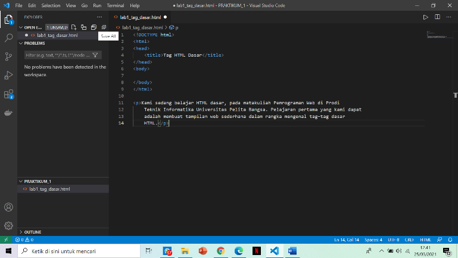
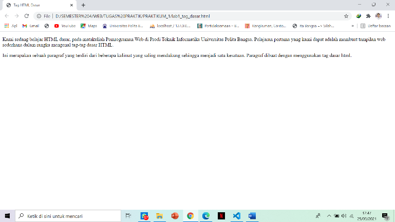

<!DOCTYPE html>
<html>

<head>

</head>

<body>

</body>

</html>
<h1>PENJELASAN DARI SETIAP TAHAPAN PRAKTIKUM</h1>

Pertama membuat folder untuk menyimpan untuk menyimpan file/project .

persiapkan text editor visual studio code , jika sudah terbuka maka open folder yang sudah dibuat.
.

 

sudah memlih folder untuk menyimpan file/project yang akan di buat.
Selanjutnya pilih new file dan tambahkan nama lab1_tag_dasar.html
 
  

Tambahkan tag dasar  document HTML. Penanda perintah di dalam HTML biasanya disebut TAG . TAG digunakan untuk menentukan tampilan dari dokumen HTML. Setiap awal dokumen HTML diawali dan diakhiri dengan Tag HTML. 

a.	DOCTYPE
Sebagai standar versi dokumen W3C yang digunakan sebagai representasi setiap elemen pada dokumen Web.

b.	HEAD 
Elemen HEAD kepala dari dokumen HTML . Tag <head> dan tag </head> terletak diantara tag <html> dan tag </html>

c.	TITLE 
Elemen TITLE merupakan judul dari dokumen HTML yang ditampilkan pada judul jendela browser . Tag <title> dan tag </title> terletak diantara tag <head> dan tag </head> 

d.	BODY 
Elemen ini menampilkan isi dokumen HTML , Tag <body> dan tag </body> terletak di bawah tag <head> dan tag </head>. 

Klik simpan dan kemudian buka menggunakan browser 

 
<h3>1.	Membuat paragraf</h3>

Penulisan paragraf bisa menggunakan tag p  , namun perlu di perhatikan tag p lebih baik di akhiri dengan tag/p.
 
 
<h3>Mengatur atribut paragraf</h3> 

Atribut align digunakan untuk menentukan mengatur paragraf. Ada bebrapa atribut align sebagai berikut : 

<h4>a.	Justify </h4>

ALIGN: JUSTIFY digunakan untuk membuat text rata kiri dan kanan. Namun efek JUSTIFY ini perlu menjadi catatan. Membuat text rata kiri dan kanan sekaligus akan membuat web browser menambah jarak (spasi) antar kata, terutama untuk kata yang panjang. Dengan cara penulisannya Align=”justify”,

<h4>b.	Left </h4>

Membuat seluruh teks ke sisi kiri halaman web , penulisannya align=”left”

<h4>c.	Center </h4>

align center  membuat seluruh teks ke tengah halaman web, penulisannya align=”center”

<h4>d.	Right</h4> 

Align  membuat seluruh teks ke sisi kanan halaman web, penulisannya align=”right”

<h4>2.	Menambahkan judul </h4>

Heading merupakan sebuah judul yang biasanya digunakan pada sebuah halaman artikel pada web. Atau terkadang dibeberapa bagian dari halaman web. Judul atau heading pada HTML dapat digunakan dengan tag h1 sampai h6 . tag h1 merupakan judul pada level pertama kemudian pada level berikutnya atau sub judul pada tag h2 sampai dengan tag h6.

<h4>3.	Memformat teks</h4>

Adapun untuk memformat tulisan/teks biasanya menggunakan berbagai macam tag sesuai dengan keperluan , sebagai berikut :

a.	b digunakan untuk membuat teks tercetak tebal ,

b.	i digunakan untuk membuat teks tercetak miring,

c.	u untuk membuat teks yang memiliki Gaya yang berbeda dari teks biasa lainnya
 

<h4>4.	Menyisipkan gambar </h4>

Untuk menyisipkan gmbar, siapkan gambar yang akan disisipkan pada halaman web, kemudian simpan file gambar tersebut satu folder dengan file dokumen html. Atau bisa juga menyisipkan gambar dari website external. HTML mendukung banyak format gambar sepert : GIF, JPEG, PNG, WMF dll . Namun jika gambar ingin dikenali oleh browser , makan GIF dan JPEG adalah format yang paling cocok . untuk menambahkan gambar digunakan tag . ingin mengatur ukuran gambar di HTML saya hanya menggunakan salah satu atribut width atau height saja.

  <h4>5.	Menambahkan Hyperlink</h4>

Link menjadi penghubung antara satu halaman dengan halaman lainnya . link merupakan suatu gambar atau teks yang terkait dengan suatu alamat tertentu . jika link di klik maka dokumen html akan menuju ke alamat tersebut . Ditandai dengan Anchor yaitu tag <a>. tag <a> mempunyai dua atribut yaitu HREF dan NAME . Atribut HREF digunakan jika sebuat Anchor akan digunakan sebagai link , sedangkan atribut NAME digunakan jika Anchor akan digunakan sebagai tujuan . 

