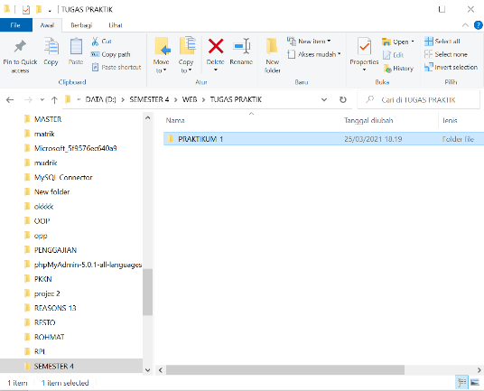
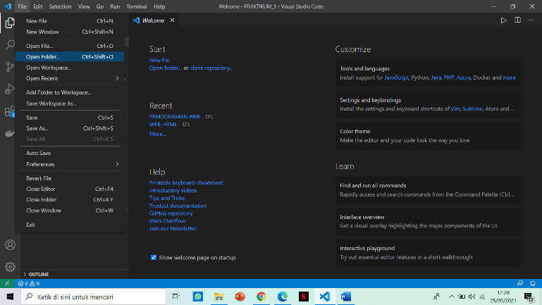
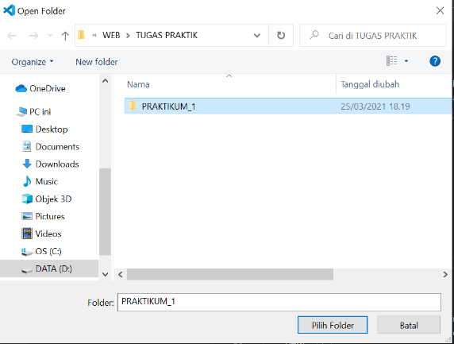
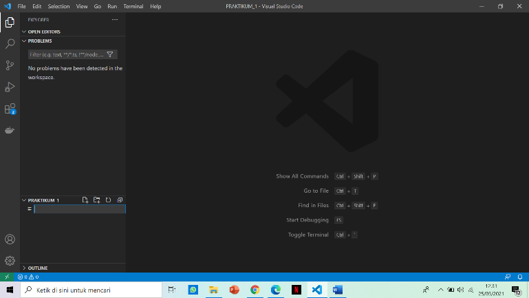
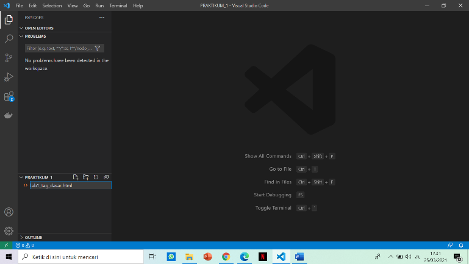
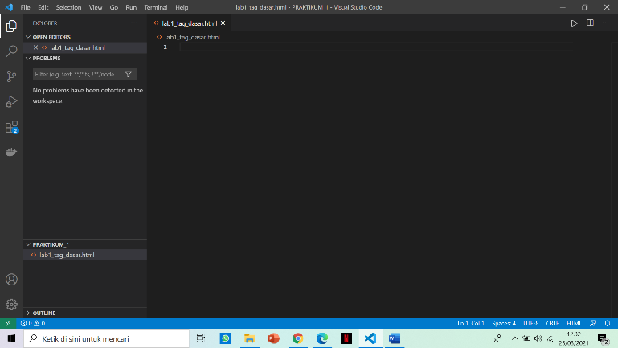
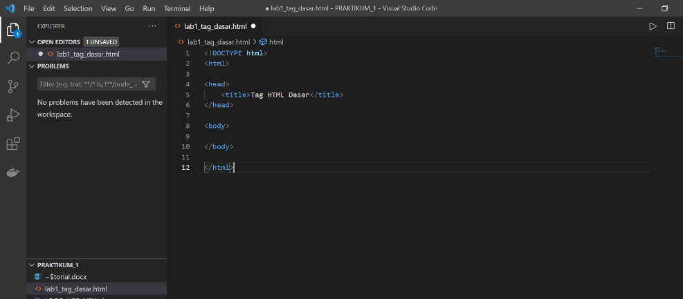
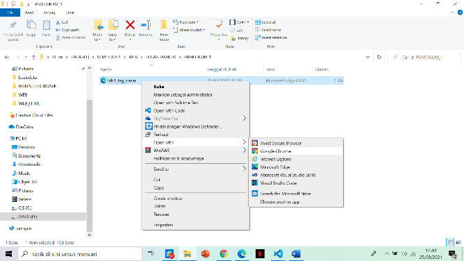
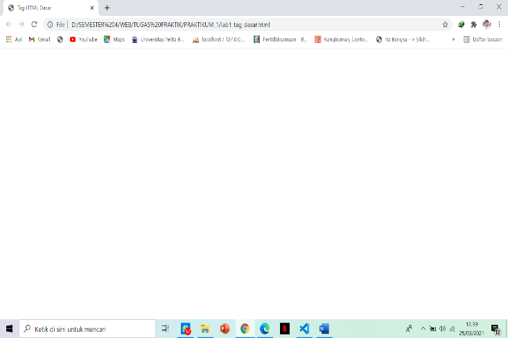

<!DOCTYPE html>
<html>

<head>

</head>

<body>

</body>

</html>
<h1>PENJELASAN DARI SETIAP TAHAPAN PRAKTIKUM</h1>

Pertama membuat folder untuk menyimpan untuk menyimpan file/project .

persiapkan text editor visual studio code , jika sudah terbuka maka open folder yang sudah dibuat.
.

 

sudah memlih folder untuk menyimpan file/project yang akan di buat.
Selanjutnya pilih new file dan tambahkan nama lab1_tag_dasar.html
 
  

Tambahkan tag dasar  document HTML. Penanda perintah di dalam HTML biasanya disebut TAG . TAG digunakan untuk menentukan tampilan dari dokumen HTML. Setiap awal dokumen HTML diawali dan diakhiri dengan Tag HTML. 

a.	DOCTYPE
Sebagai standar versi dokumen W3C yang digunakan sebagai representasi setiap elemen pada dokumen Web.

b.	HEAD 
Elemen HEAD kepala dari dokumen HTML . Tag <head> dan tag </head> terletak diantara tag <html> dan tag </html>

c.	TITLE 
Elemen TITLE merupakan judul dari dokumen HTML yang ditampilkan pada judul jendela browser . Tag <title> dan tag </title> terletak diantara tag <head> dan tag </head> 

d.	BODY 
Elemen ini menampilkan isi dokumen HTML , Tag <body> dan tag </body> terletak di bawah tag <head> dan tag </head>. 

Klik simpan dan kemudian buka menggunakan browser 

 

1.	Membuat paragraf
Penulisan paragraf bisa menggunakan tag 
  , namun perlu di perhatikan tag 
 lebih baik di akhiri dengan tag
 

